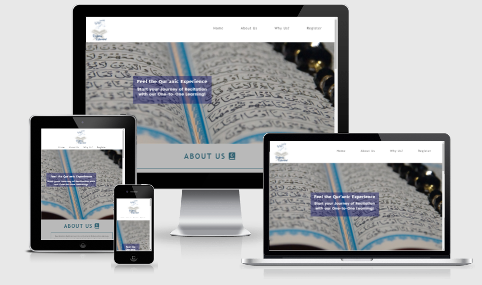

## Recitation Refinement

Recitation Refinement is a Qur'anic Education Group that serves the need of Adult Muslims who wish to take the path of learning the recitation and memorisation of the Qur'an. The objective of this programme is to facilitate Qur'anic Education towards Muslims of all backgrounds. As this is an Islamic institution targetted towards Muslims that want to learn the Qur'an, I decided to ensure there was a Qur'anic theme throughout the entire webpage so that the audience can feel the purpose as soon as they visit the website.

In an era of technological advances with smartphones, many users will be visiting the site just from their mobiles. Therefore, the site uses a one-page format, as this brings ease to users who wish to view the website on their phones. 

# Features 

## Header

### Logo
- The opening section of the page is the header which contains the logo and the navigation menu. 
- The logo portrays both the organisation and the purpose of the website.

### Navigation Bar
- The navigation bar is located within the header and consists of the 'Poppins' font which is the same font as all the paragraph text in order to maintain consistency.
- The options contain a hover function that changes the colour of the text to white and the background to a dark blue colour, which is in-line with the colour scheme of the logo.

