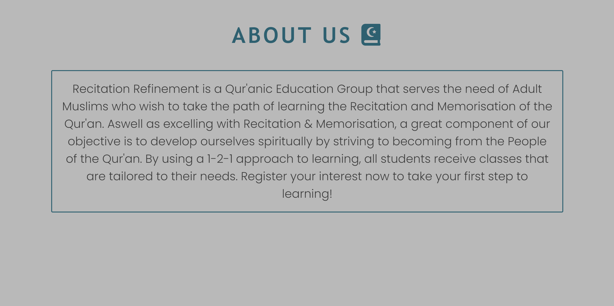

## Recitation Refinement

Recitation Refinement is a Qur'anic Education Group that serves the need of Adult Muslims who wish to take the path of learning the recitation and memorisation of the Qur'an. The objective of this programme is to facilitate Qur'anic Education towards Muslims of all backgrounds. As this is an Islamic institution targetted towards Muslims that want to learn the Qur'an, I decided to ensure there was a Qur'anic theme throughout the entire webpage so that the audience can feel the purpose as soon as they visit the websit
In an era of technological advances with smartphones, many users will be visiting the site just from their mobiles. Therefore, the site uses a one-page format, as this brings ease to users who wish to view the website on their phones. 

# Features 

## Header

### Logo
- The opening section of the page is the header which contains the logo and the navigation menu. 
- The logo portrays both the organisation and the purpose of the website.

### Navigation Bar
- The navigation bar is located within the header and consists of the 'Poppins' font which is the same font as all the paragraph text in order to maintain consistency.
- The options contain a hover function that changes the colour of the text to white and the background to a dark blue colour, which is in-line with the colour scheme of the logo. It also initiates the feeling of familiarity of the organisation due to the recognition of the same colour. 

## Hero Image
- The Hero Image used is an open Qur'an as this is the first thing that will catch the eye of the user and give an immediate representation of what the organisation is all about. It also foreshadows the product of what the organisation is selling to the user as by signing up to the programme, they will regularly be opening and looking at the Qur'an The colour of the image was also carefully considered due to the blue design of the pages and the black scripture, which is consistent with the colours used in the website. 
- A Zoom-in animation was used in order to reflect the exact vision of the organisation upon the user. A Programme that is focussed on the Qur'an only.
- The Image text has a dark blue background to remain consistent with the colour scheme, and the colour of the text is white in order to give the right contrast with the background. The usage of black text was avoided as this would clash with the Hero Image. The text works in synergy with the Hero Image as it conveys the purpose of the organisation by foreshadowing what they would feel by signing up to the programme through use of command verbs.

## About Us

- This gives an informative background to the organisation and outlines the purpose of the programme through brief explanations of the ongoing initiatives they can be involved in. The language used ensures the user feels spiritually captivated and motivated to take on this journey. 
- This section was kept simple with no image as the user would have just seen the large hero image when first entering the website. It also ensures the user is not distracted with anything other than knowing the exact details of the programme. 
- A grey background was used in order to maintain with the colour scheme of the organisation and to also for the user distinguish between the sections of the page. 
- The Title and Border are the same dark blue colour as seen within hovering over the menu options. This will further develop familiarity and recognition of the user with the organisation. 
- The text colour is black in order to coordinate with the text-colour of the navigation menu and to also produce a clear contrast with the background. 

## Why Us

- This section outlines the qualities of the organisation that makes them distinct to other Islamic institutions. 
- The heading font is consistent with the font of the the heading of the about us section and the heading of the image text of the hero image. This will further develop the feeling of familiarity and make the user feel at home. 
- There are 4 subheadings with respective paragraphs to outline the distinct features of the programme and each sub-section is focussed on what the user would receive by registering to the programme. 
- The paragraph text are all consistent in colour and font with one-another and with the paragraph text of the 'about us' section and navigation menu. 
- The subheading font and colour is also consistent with the heading font, but it is not capitalised in order to clearly distinguish it as a subheading. 
- The Center Image is an image of the current group of students and has a circular frame in order to depict the fact the user themselves will be part of a circle of students on the same journey. 
- The Information surround the image in order to depict the idea that the organisation conducts classes and programmes centered around the student's needs. 
- A plain, white background was kept in order to maintain the colour scheme of the organisation and to distinguish it as a separate section for the user, aswell as provide contrast with colour of the text. 

## Register Form

- This section contains the register form for the user to register their interest and to find out more information on the steps to join the programme.
- The background of thesection is an open Qur'an which coordinates well with the hero image. But it also signifies the act of starting to learn the Qur'an which would give the user the feeling of beginning their journey of learning by submitting the form. 
- The Register Form contains a charcoal grey background which distinctly outlines the form.
- The text is in white in order to maintain consistency with the colour scheme of the webpage and also give complete contrast with the background.
- The form requires first and last name, level of recitation with 3 level options and email address. 
- The text input section changes to the same dark blue colour in order to give the user a feeling of action. 
- The register button has a grey background with font that is in-line with the title the headings of the other sections. It also changes colour to the same dark blue background to maintain consistency and to give the feeling of change for the user. 

## Footer

- Encourages users to stay up to date with the programme by following social networks
- It contains Social Media Icons that have the same dark blue colour to still remain consistent with the colour scheme of the page.
- It then changes to a white colour with the same dark blue colour upon hovering to match the style of hovering over the navigation menu.
- Directs the user to the respective site on a new page.

## Responsive Design

The Header content, the 'Why Us' section, the Register Form and Footer were the main sections considered when coding the media queries for tablet and mobile screens. Some time was spent in particular with the the 'Why Us' section in order to ensure the elements became stacked upon one another and that all content became centrally aligned. This would prevent compromising the section to having a small image and and small text which would not be user-friendly. 

The flow of both mobile and tablet designs are consistent and work well. The logo and navigation menu were centered and stacked in order to prevent both elements from being congested. Below is the mobile version of the site:

            

